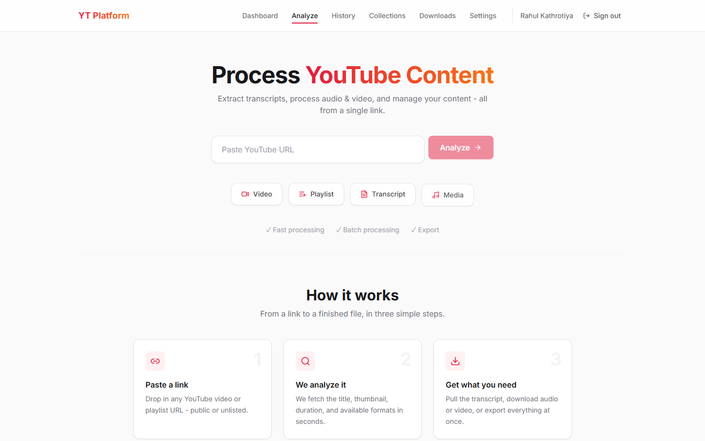
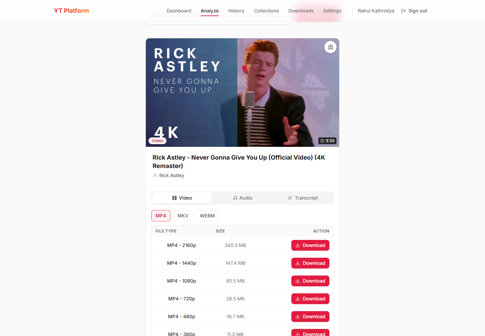
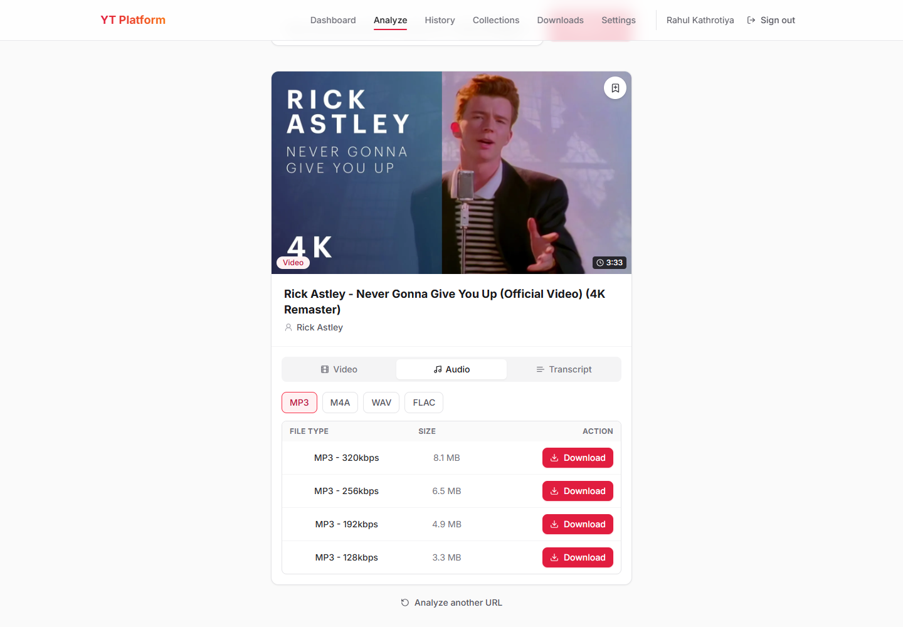
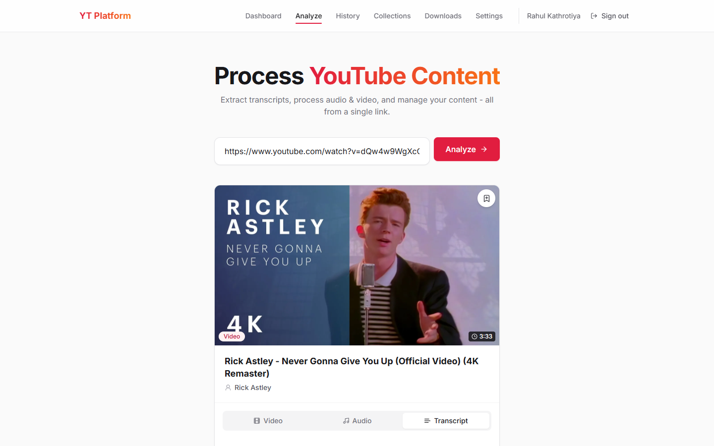
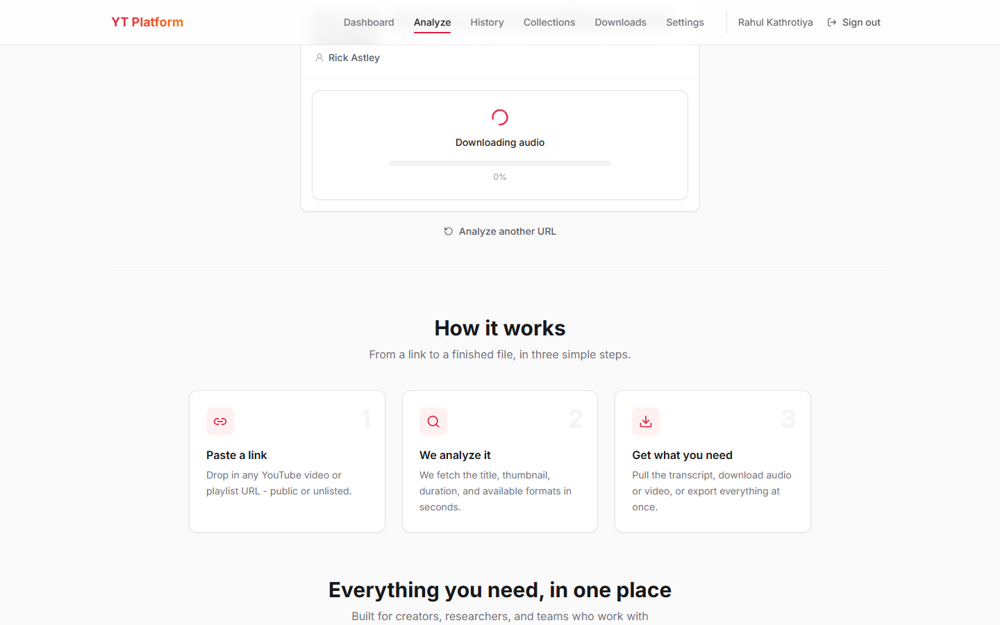
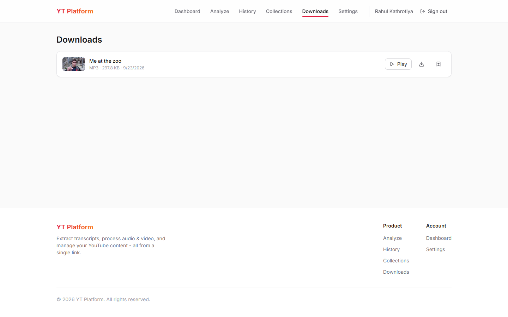
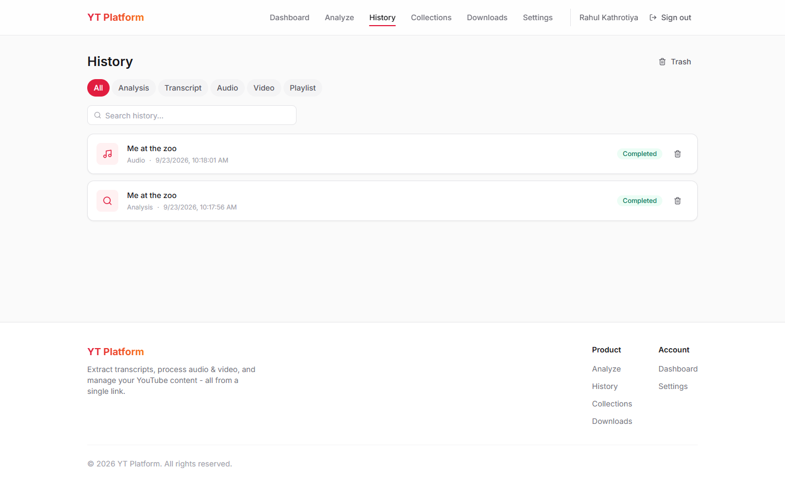
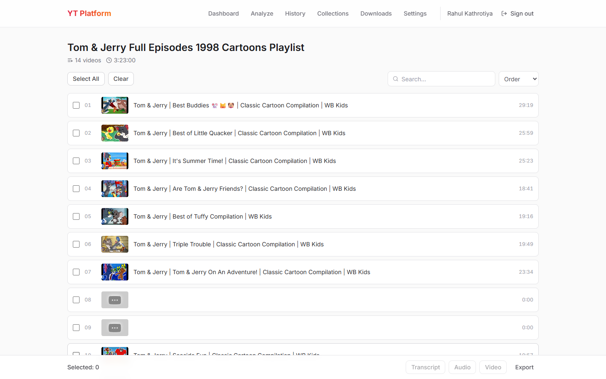
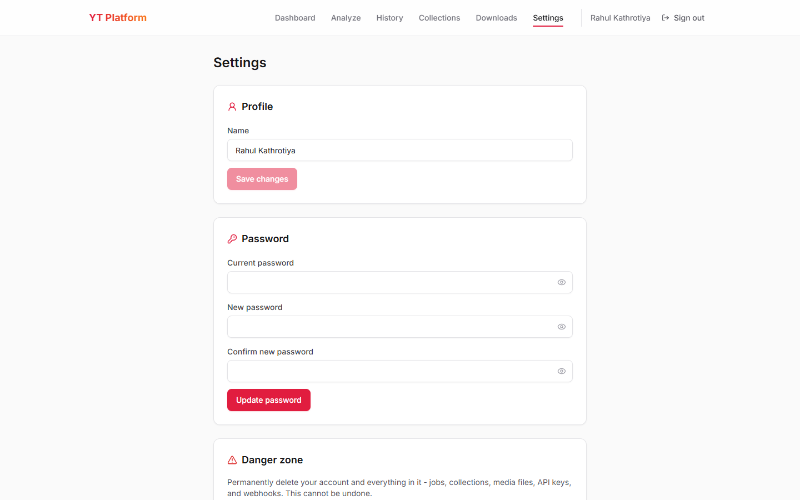
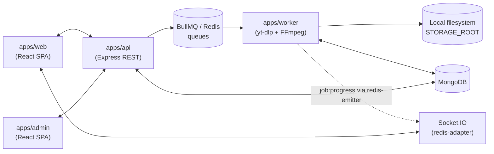

# 🎬 YouTube Utility Platform

A monorepo SaaS platform for processing YouTube content: video/playlist analysis, transcript
extraction, audio/video download at dynamic per-video quality, playlist batch processing, an
export center, and history/collections - built on a job-queue architecture so no heavy
yt-dlp/FFmpeg work ever blocks the API process.

## ✨ Features

- **Smart URL analyzer** - paste a YouTube video or playlist URL and get back title, thumbnail,
  duration/channel, and (for a single video) the real per-quality download sizes straight from
  yt-dlp - no separate "fetch info" step.
- **Dynamic video quality list** - only shows the resolutions a video actually has. A 4K upload
  offers 2160p down to 360p with real sizes for each; a video capped at 480p shows just what's
  really available, instead of duplicate rows that all resolve to the same file.
- **Inline download with live progress** - clicking Download doesn't navigate away: the format
  picker is replaced in place by a real-time progress bar (via Socket.IO, backed by yt-dlp's own
  download percentage), then a ready-to-download card, all on the same screen.
- **Transcript extraction with language auto-detection** - genuinely detects the video's spoken
  language from yt-dlp's caption metadata (never guesses), lets you switch to any other available
  language, and renders a searchable transcript viewer with TXT/SRT/VTT/JSON/Markdown export.
- **Playlist batch processing** - select any subset of a playlist's videos and bulk-run transcript,
  audio, or video jobs across all of them, with per-video progress tracked individually.
- **Export Center** - CSV/JSON playlist manifests, a combined transcript file across an entire
  playlist, or a ZIP bundle of every downloaded media file - all through the same job queue.
- **History & Collections** - every job you've ever run, filterable and searchable, with soft
  delete/restore; save any video, playlist, transcript, or media file into named collections.
- **Realtime everywhere** - job progress streams over Socket.IO the moment it changes, backed by
  Redis pub/sub so it works the same whether the worker and API are on the same box or not.
- **Permanent, self-hosted downloads** - files live on local disk and are served through
  HMAC-signed URLs with no expiry and no cleanup sweep, the same trust model as a cloud presigned
  URL, minus the cloud bill.
- **Admin dashboard** - a separate app for user/job/queue/worker/storage monitoring and audit
  logs, gated to `admin`/`support` roles.
- **Auth without third-party dependencies** - plain email/password with JWT access tokens and
  rotating refresh tokens; no OAuth, no billing/subscription system to get in the way.

## 📸 Screenshots

All captured from the app running locally (`pnpm dev`) against a fresh account.

### Analyzer

|                                                             |                                                                                      |
| ----------------------------------------------------------- | ------------------------------------------------------------------------------------ |
|  |  |
| The landing/analyze page before a URL is submitted.         | A 4K upload's dynamic quality list - 2160p down to 360p, each with a real size.      |

|                                                                            |                                                                                             |
| -------------------------------------------------------------------------- | ------------------------------------------------------------------------------------------- |
|  |                    |
| The Audio tab, with per-bitrate size estimates.                            | The Transcript tab - language auto-detected, switchable before requesting a transcript job. |

### Downloading

|                                                                                                |                                                                                      |
| ---------------------------------------------------------------------------------------------- | ------------------------------------------------------------------------------------ |
|                   |              |
| Clicking Download replaces the format picker in place with live progress - no page navigation. | The Downloads page, showing the real video thumbnail instead of a generic file icon. |

### Everything else

|                                                       |                                                                                    |
| ----------------------------------------------------- | ---------------------------------------------------------------------------------- |
|  |                        |
| Every past job, searchable and filterable by type.    | A playlist's videos with per-item checkboxes for bulk transcript/audio/video jobs. |



Account settings - profile, password change, and a danger-zone account deletion that cascades
every job, collection, and media file.

## 🧰 Tech stack

| Technology                                     | Role                                                                                          |
| ---------------------------------------------- | --------------------------------------------------------------------------------------------- |
| React 18 + Vite + Tailwind                     | `apps/web` (customer app) and `apps/admin` (internal dashboard)                               |
| Express + TypeScript                           | `apps/api` - REST API, never runs yt-dlp/FFmpeg itself                                        |
| BullMQ + Redis                                 | Job queues (metadata, transcript, audio, video, playlist, export)                             |
| yt-dlp + FFmpeg + Deno                         | `apps/worker` - extraction, download, transcode/remux; Deno solves YouTube's JS "n" challenge |
| MongoDB + Mongoose                             | Persistence, shared between API and worker via `@ytp/db`                                      |
| Socket.IO + `@socket.io/redis-adapter/emitter` | Realtime job progress, fanned out through Redis pub/sub                                       |
| Zod                                            | Runtime validation shared between API and web forms (`@ytp/validators`)                       |
| Local filesystem storage + HMAC-signed URLs    | `@ytp/storage` - no cloud bucket, permanent downloads                                         |
| Turborepo + pnpm workspaces                    | Monorepo tooling                                                                              |
| ESLint, Prettier, Husky, commitlint, Gitleaks  | Code quality and security gates                                                               |

## 🏗️ Architecture



Never `Frontend → API → heavy yt-dlp/FFmpeg process → wait`. The worker holds no live WebSocket
connections (only the API does), so it publishes progress into Redis channels the API's
`@socket.io/redis-adapter` subscribes to - see `apps/worker/src/realtime/emitter.ts`. See
[docs/README.md](docs/README.md) for the full architecture writeup, including the storage model
and known gotchas (e.g. yt-dlp needing `--ffmpeg-location` explicitly).

## 📁 Project structure

```text
apps/
  web/       React + Vite customer app
  api/       Express + TypeScript REST API - owns MongoDB, enqueues jobs, never runs yt-dlp/FFmpeg
  worker/    BullMQ workers (metadata/transcript/audio/video/playlist/export) + yt-dlp/FFmpeg
  admin/     React + Vite internal dashboard (users/jobs/queues/workers/storage/audit)
packages/
  types/         Shared TypeScript interfaces
  validators/    Zod schemas used by both the API and web forms
  db/            Mongoose models shared between apps/api and apps/worker
  storage/       Local-filesystem storage client (signed URLs, no cloud bucket)
  ui/            Shared design system components
  config/        Env loading
  utils/         formatBytes/formatDuration/sanitizeFilename/...
  eslint-config/ tsconfig/   Shared lint/TS presets
docs/        README.md - product spec, architecture, API reference, database schema
storage-data/  Local media storage root (gitignored contents, kept out of the repo)
docker-compose.yml   MongoDB + Redis for local dev
```

## 🔄 Data flow

**Analyzing a URL:**

```text
AnalyzerPage (URL input)
  -> POST /api/v1/analyzer
  -> enqueues a metadata job onto BullMQ
  -> worker shells out to yt-dlp, upserts Video/Playlist(+PlaylistItems)
  -> API awaits the job result and responds with AnalyzerResult
```

**Downloading audio/video, with live progress:**

```text
AnalyzerResultCard (Download click)
  -> POST /api/v1/media/{audio,video}
  -> 202 { jobId } - job created, useJobQuery starts polling + subscribes over Socket.IO
  -> worker: downloads via yt-dlp (streaming its own % into the job's progress field)
          -> transcodes/remuxes via FFmpeg
          -> uploads to local storage, creates a MediaFile record
  -> job:progress / job:completed events push straight to the browser
  -> AnalyzerResultCard swaps its format picker for the progress bar, then a download-ready card
```

## 🔑 Environment variables

Each app has its own `.env` (copy from the matching `.env.example`). The important ones:

| App       | Variable                                            | Purpose                                                                  |
| --------- | --------------------------------------------------- | ------------------------------------------------------------------------ |
| api       | `MONGODB_URI` / `REDIS_URL`                         | Shared MongoDB/Redis connections                                         |
| api       | `JWT_SECRET` / `JWT_REFRESH_SECRET`                 | Access/refresh token signing                                             |
| api       | `STORAGE_ROOT`                                      | Absolute path to local media storage - **must match** `apps/worker`'s    |
| api       | `STORAGE_SIGNING_SECRET`                            | HMAC secret for signed download URLs                                     |
| worker    | `MONGODB_URI` / `REDIS_URL` / `STORAGE_ROOT`        | Same values as the API                                                   |
| worker    | `YTDLP_PATH` / `FFMPEG_PATH` / `FFPROBE_PATH`       | Binary locations - full path if not reliably on this process's PATH      |
| worker    | `YTDLP_COOKIES_FILE` / `YTDLP_COOKIES_FROM_BROWSER` | Optional - only needed once YouTube blocks anonymous requests            |
| worker    | `YTDLP_EXTRA_PATH`                                  | Optional - a JS runtime's directory (Deno) for yt-dlp's challenge solver |
| web/admin | `VITE_API_URL`                                      | Where the API lives                                                      |

See [docs/README.md](docs/README.md) for the complete list and per-variable detail.

## 💻 Local development

Requires Node 24+, pnpm, Docker, and on your system PATH (or pointed at via the env vars above):
**yt-dlp**, **FFmpeg**, and **Deno** (yt-dlp's JS challenge solver - without it, some downloads
fail with `"The page needs to be reloaded."` once YouTube enforces SABR streaming).

```bash
pnpm install

# copy env files
cp apps/api/.env.example apps/api/.env
cp apps/worker/.env.example apps/worker/.env
cp apps/web/.env.example apps/web/.env
cp apps/admin/.env.example apps/admin/.env

# start MongoDB + Redis
docker compose up -d

# start web, api, worker, admin together
pnpm dev
```

- Web: http://localhost:3000
- Admin: http://localhost:3001
- API: http://localhost:4000

## ⚙️ Available commands

| Command                        | Purpose                                  |
| ------------------------------ | ---------------------------------------- |
| `pnpm dev`                     | Run all apps in dev mode (via Turborepo) |
| `pnpm build`                   | Build all apps/packages                  |
| `pnpm lint`                    | ESLint across the workspace              |
| `pnpm typecheck`               | `tsc --noEmit` across the workspace      |
| `pnpm quality`                 | Format check + lint + typecheck          |
| `pnpm format` / `format:check` | Prettier write / check                   |
| `pnpm security:audit`          | `pnpm audit --audit-level=high`          |
| `pnpm clean`                   | Clean build output and `node_modules`    |

## 🔒 Code quality and security

Strict TypeScript across every package, a flat ESLint config with type-aware rules, and Prettier
formatting enforced in CI. A Husky pre-commit hook runs Gitleaks secret scanning, `lint-staged`,
and the full `quality` check before any commit is allowed through; `commit-msg` enforces
Conventional Commits via commitlint. Auth uses short-lived JWT access tokens plus rotating,
HttpOnly-cookie refresh tokens - reuse of an already-rotated token revokes every session for that
user. Downloads are gated by HMAC signature, not by being behind auth, so links stay embeddable
without ever exposing the underlying filesystem path.

There's no automated test suite yet - correctness is currently verified by hand (typecheck, lint,
and live end-to-end runs against a real dev server) for every change; see
[Future improvements](#-future-improvements).

## 🧠 Design decisions

- **Job queue over synchronous processing** - every yt-dlp/FFmpeg operation runs in `apps/worker`,
  never inline in the API request, so a slow download can't tie up an API worker thread.
- **Local filesystem storage over a cloud bucket** - permanent, self-hosted downloads via HMAC-
  signed URLs instead of a short-lived S3/R2 presigned URL + TTL cleanup sweep - simpler to run
  and reason about for a single-box deployment.
- **Redis-relayed Socket.IO instead of direct worker sockets** - the worker never holds a
  WebSocket connection, so the API can scale to multiple instances later without touching this code.
- **Dynamic quality ladder over a fixed list** - the download picker asks "what does this specific
  video actually have?" instead of offering resolutions that silently collapse into duplicates.
- **Genuine language auto-detection over a default** - yt-dlp's caption metadata marks the real
  ASR-original track explicitly; that's used instead of guessing or hardcoding `en`.

## 🐛 Troubleshooting

- **`yt-dlp: command not found` / `ENOENT`** - set `YTDLP_PATH` in `apps/worker/.env` to the
  binary's full path; some installs (e.g. `pip install --user`) put it somewhere not every shell's
  PATH includes.
- **`"The page needs to be reloaded."` from yt-dlp** - YouTube is enforcing SABR streaming and
  yt-dlp couldn't solve the JS "n" challenge. Install Deno and set `YTDLP_EXTRA_PATH` to its
  directory (see [Environment variables](#-environment-variables)).
- **`"Sign in to confirm you're not a bot"`** - set `YTDLP_COOKIES_FILE` to a real
  Netscape-format `cookies.txt` exported from a logged-in browser session; these expire
  periodically and need re-exporting.
- **Video downloads but has no audio (or vice versa)** - yt-dlp needs `--ffmpeg-location` to merge
  separate video+audio streams; without it, it silently leaves them unmerged. Set `FFMPEG_PATH`.
- **Port already in use on `pnpm dev`** - a previous `pnpm dev` instance (yours or a leftover
  background one) is still holding 3000/3001/4000; stop it before starting a new one.

## 🚀 Future improvements

- An automated test suite (unit + integration) - currently the biggest gap.
- Billing/usage plans (deliberately out of scope for now - see [docs/README.md](docs/README.md)).
- Fix a refresh-token race: rapid concurrent `/auth/refresh` calls (e.g. several tabs, or quick
  successive page reloads) can trigger the reuse-detection logic and revoke a legitimate session.
- AI features (summary, chat, RAG) - explicitly deferred, addable later as a separate worker
  without restructuring the existing pipeline.
